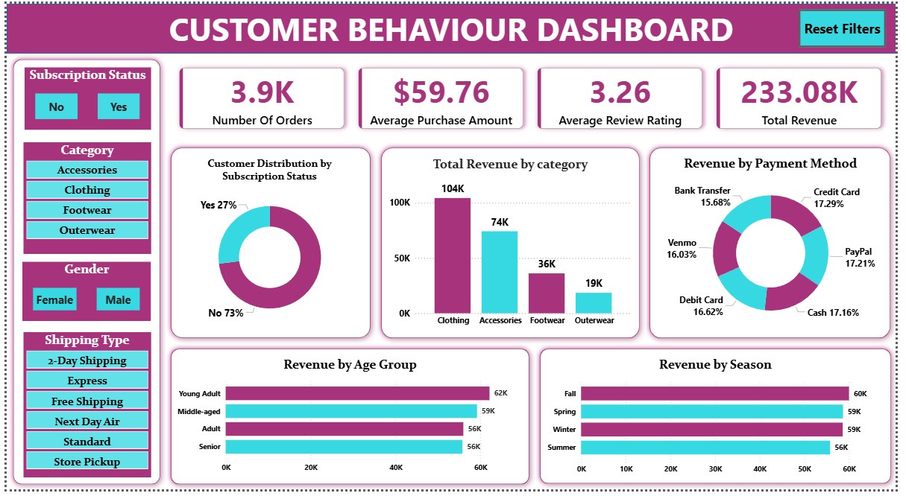

# 🛍️ Customer Shopping Behavior Analysis

<h3 align="center">
End-to-End Data Analytics Project using Python • SQL • Power BI
</h3>

<p align="center">


</p>

---

# 📌 Project Overview

This project analyzes customer shopping behavior using transactional retail data to uncover purchasing patterns, customer demographics, revenue trends, and business opportunities.

The project follows a complete **end-to-end data analytics workflow**, starting from data cleaning and exploratory analysis to SQL-based business insights and an interactive Power BI dashboard.

---

# 🎯 Business Problem

Retail businesses collect a vast amount of customer transaction data but often struggle to transform it into actionable insights.

The goal of this project is to analyze customer purchasing behavior and identify trends that can help businesses:

- Improve customer retention
- Increase revenue
- Optimize marketing strategies
- Enhance customer experience
- Support data-driven decision making

---

# 🚀 Project Workflow

```text
Business Problem
        │
        ▼
Data Collection
        │
        ▼
Python
Data Cleaning & EDA
        │
        ▼
SQL
Business Analysis
        │
        ▼
Power BI
Interactive Dashboard
        │
        ▼
Business Insights
        │
        ▼
Recommendations
```

---

# 📊 Dashboard Preview

<p align="center">



</p>

---

# 📈 Dashboard KPIs

| KPI | Value |
|------|-------|
| 📦 Number of Orders | **3.9K** |
| 💰 Total Revenue | **$233.08K** |
| 🛒 Average Purchase Amount | **$59.76** |
| ⭐ Average Review Rating | **3.26** |

---

# ✨ Key Features

✅ Data Cleaning

✅ Exploratory Data Analysis (EDA)

✅ SQL Business Queries

✅ Interactive Power BI Dashboard

✅ Customer Segmentation

✅ Revenue Analysis

✅ Business Insights

✅ Data Visualization

---

# 🛠️ Technologies Used

| Technology | Purpose |
|------------|---------|
| 🐍 Python | Data Cleaning & EDA |
| 🐼 Pandas | Data Manipulation |
| 🔢 NumPy | Numerical Analysis |
| 🗄 SQL Server | Business Analysis |
| 📊 Power BI | Dashboard Development |
| 📓 Jupyter Notebook | Python Analysis |

---

# 📂 Repository Structure

```text
Customer-Shopping-Behavior-Analysis
│
├── Dataset
│   └── Customer_Shopping_Behavior.csv
│
├── Images
│   └── Dashboard.png
│
├── PowerBI
│   └── Customer_Shopping_Behavior_Dashboard.pbix
│
├── Presentation
│   └── Customer-Shopping-Behavior-Analysis.pptx
│
├── Python
│   └── Customer_Shopping_Behavior_Analysis.ipynb
│
├── Report
│   ├── Business Problem Statement.pdf
│   └── Customer Shopping Behaviour Analysis.pdf
│
├── SQL
│   └── Customer_Shopping_Behavior_SQL_Queries.sql
│
└── README.md
```

---

# 📌 Business Questions Answered

- Which product category generates the highest revenue?
- Which age group contributes the highest revenue?
- Which payment methods are preferred?
- How does subscription status influence purchasing behavior?
- Which shipping methods are most popular?
- Which season generates maximum revenue?
- Which customer segment contributes the highest sales?
- Which products receive the highest customer ratings?

---

# 📈 Dashboard Insights

### Customer Analysis

- Subscription status distribution
- Revenue by age group
- Gender-based customer analysis

### Revenue Analysis

- Revenue by category
- Revenue by season
- Revenue by payment method

### Performance Metrics

- Total Revenue
- Average Purchase Amount
- Customer Rating
- Number of Orders

---

# 🐍 Python Analysis

The notebook includes:

- Data Import
- Data Cleaning
- Missing Value Handling
- Exploratory Data Analysis
- Feature Engineering
- Statistical Analysis
- Data Visualization

---

# 🗄 SQL Analysis

SQL queries were used to analyze:

- Revenue by Category
- Revenue by Gender
- Revenue by Age Group
- Subscription Analysis
- Customer Segmentation
- Product Performance
- Seasonal Sales
- Payment Method Analysis
- Shipping Preferences

---

# 💡 Key Business Insights

✔ Clothing generated the highest revenue.

✔ Young Adult customers contributed the highest sales.

✔ Revenue is evenly distributed across payment methods.

✔ Seasonal purchasing trends provide promotional opportunities.

✔ Customer subscriptions can improve long-term retention.

---

# 📁 Project Files

📊 Dataset

🐍 Python Notebook

🗄 SQL Queries

📈 Power BI Dashboard

📄 Business Problem Statement

📘 Project Report

📽 Project Presentation

---

# 🔮 Future Enhancements

- Customer Segmentation using Machine Learning
- Customer Lifetime Value Prediction
- Sales Forecasting
- Recommendation System
- Power BI Service Deployment
- Automated Data Refresh

---

# 👨‍💻 Author

## Vinay Kumar

**Data Analyst**

🔗 GitHub  
https://github.com/VinayKumar2416

🔗 LinkedIn  
https://www.linkedin.com/in/vinaykmr24

---

<p align="center">

⭐ If you like this project, consider giving it a Star!

</p>
